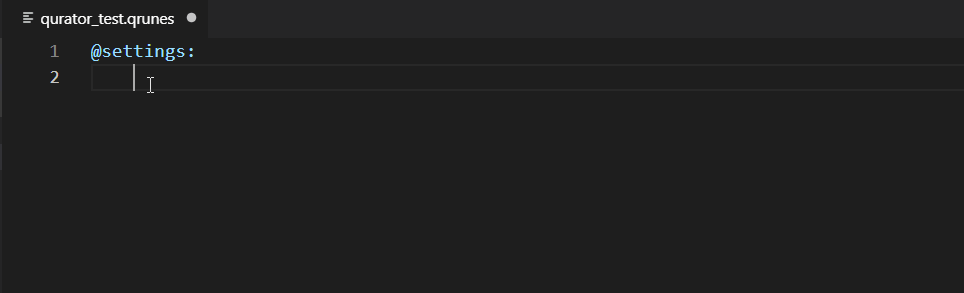
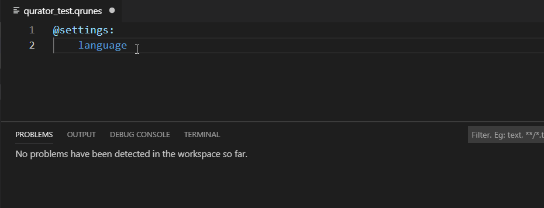
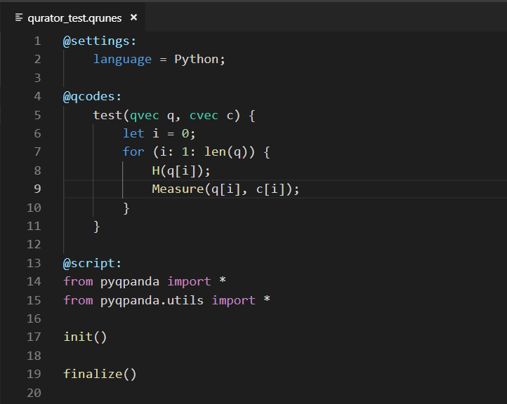
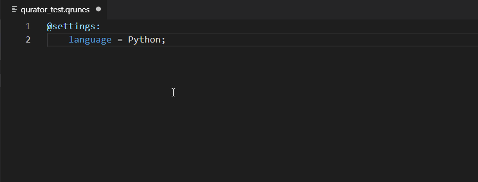
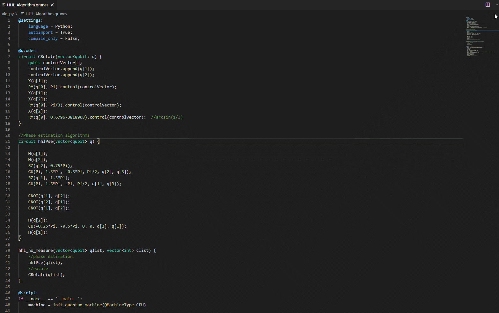
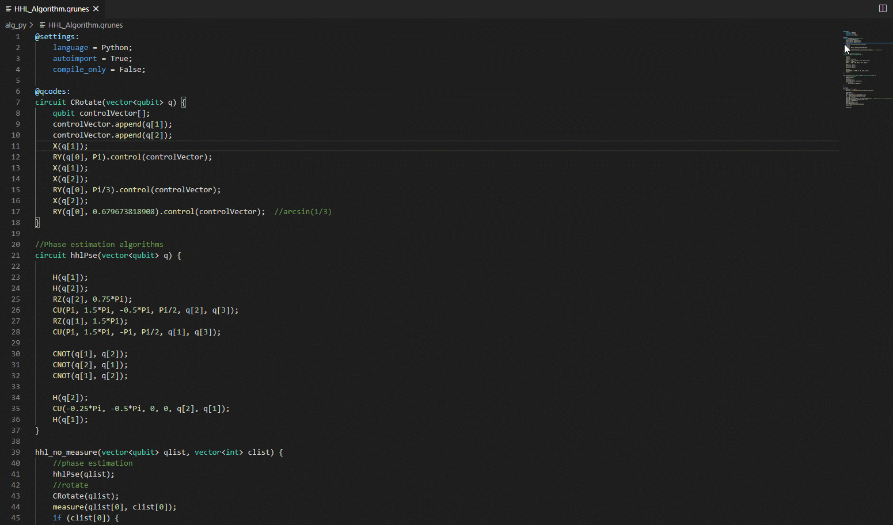

功能介绍
=============

相信在快速入门步骤之后，您已大体了解插件的整体功能，下面将介绍您在编辑量子程序过程中插件提供的辅助功能：

1. 自动补全
-------------

对于 QRunes2 语言内设的关键字可以智能提示，根据输入的字符列为您提供当前上下文中适用的最相关符号列表并提示其功能，
以便您可以更快地选择。
 

2. 验证提示
-------------

对于输入进行验证并提示。每当插件检测到您编写的代码发生语法错误时，编辑器中会显示红色波浪线，
鼠标放上去可看到一系列错误信息，您可以准确定位错误发生的位置。

3. 高亮展示
-------------

不同的模块有不同的颜色划分，您可以清晰地编写每一个模块的代码，一目了然，快速开发。

4. 悬浮提示
-------------

QRunes2 语言中的方法、变量都有详细的解释及用法。每当您编写 QRunes2 语言内设关键字时，
将鼠标放在该关键字上，编辑器将会显示该关键字的功能信息。

5. 智能片段
-------------

智能片段功能是指用户输入简短的触发指令而生成完整的代码片段，在本插件中内置了自定义代码片段，
可帮助您整理一些重复性代码，提高开发效率。

.. image:: ../images/snippet.gif

插件支持的片段有：

===============  ===========================================================
    片段                          简介
===============  ===========================================================
@settings4py       宿主语言为 Python 时的 settings 模块片段
@settings4cpp      宿主语言为 Cpp 时的 settings 模块片段 
@qco               qcodes 模块片段
@script4py         宿主语言为 Python 时的 script 模块片段
@script4cpp        宿主语言为 Cpp 时的 script 模块片段
@sqs4py            宿主语言为 Python 时的三个模块片段
@sqs4cpp           宿主语言为 Cpp 时的三个模块片段
quanmac           宿主语言为 Python 时 init_quantum_machine 方法参数
===============  ===========================================================

6. 语言切换
-------------

目前 QRunes2 语言可以支持 Python 及 C++ 宿主语言，您可以在 settings 模块的 language 关键字来设置
所需支持的语言类型，就可以在script模块编写相应语言的代码。

.. image:: ../images/languageChange.gif

7. 定义跳转 
-------------

定义跳转功能是指：在qcodes部分快速定位所调用的方法。

8. 编译运行
-------------

运行 QRunes2 语言代码，编译器会根据设定的语言去编译该代码，从而实现不同的语言编写生成相同的结构。

