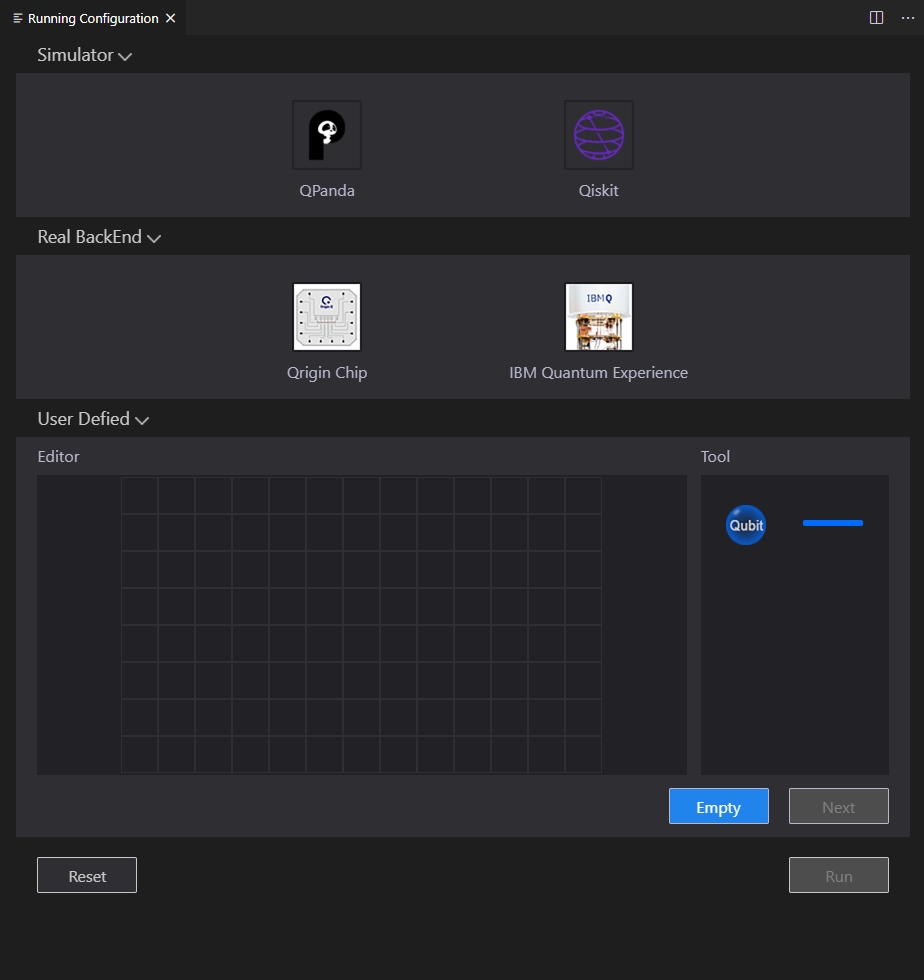
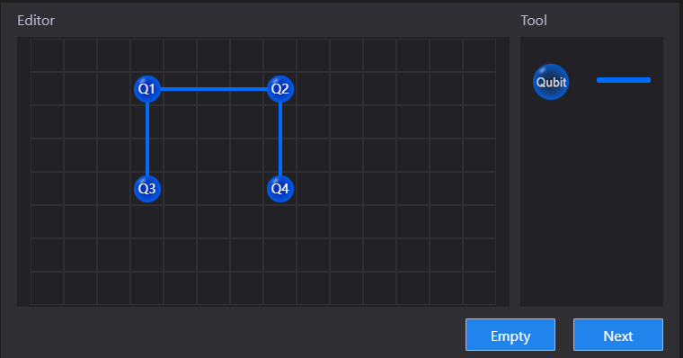
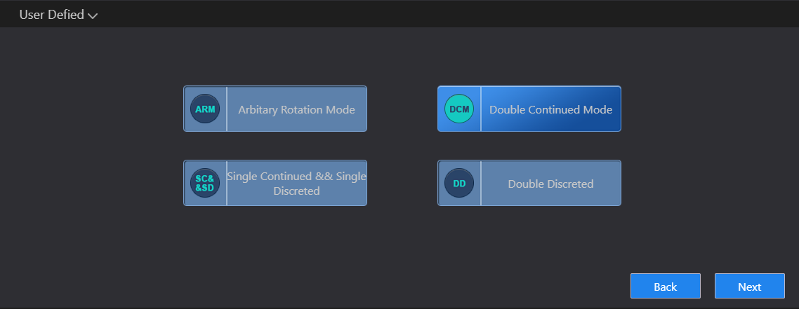
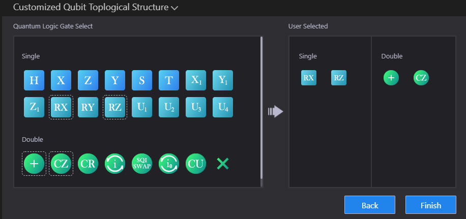
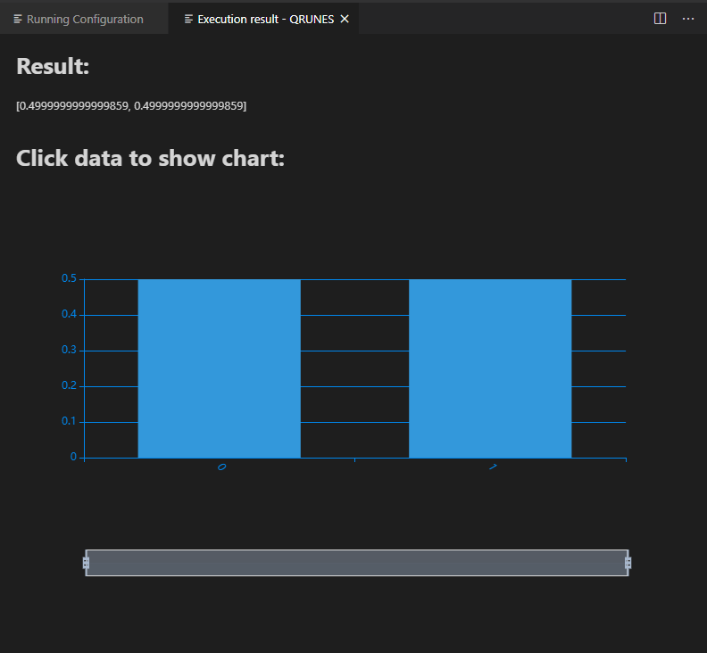

快速入门
=============

在做好准备工作之后，下面就可以编写属于您自己的量子程序了。

1.项目文件夹中启动 VS Code
-------------------------------

在命令提示符或终端上，创建一个名为 "test" 的空文件夹，切换到该文件夹，然后输入命令 code . 在该文件夹中打开 VS Code：

::

    mkdir test
    cd test
    code .

或者，您可以点击运行 VS Code，然后点击 "File" > "Open File..." 打开项目文件夹。

在文件夹中启动 VS Code，该文件夹将成为您的“工作区”。您可以在 .vscode/settings.json 文件中更改工作区的相关设置。

2.创建一个 qrunes 文件
------------------------

在文件资源管理器工具栏中，单击 "test" 文件夹上的 "New File" 按钮，并命名该文件为 qurator_test.qrunes。

.. image:: ../images/qurator_test.png
    :width: 600px

3.编写量子程序
----------------

qrunes 文件创建完成之后，便可以编写量子程序了。整个量子程序分为三个部分：settings、qcodes 和 script 三个模块。

其中，settings 模块中可以设置宿主语言，编译还是运行；qcodes 模块中可以编写 QRunes2 量子语言代码；
script 模块中可以编写宿主语言代码，目前支持 Python 和 C++ 两种宿主语言。

::

    @settings:
        language = Python;
        autoimport = True;
        compile_only = False;

    @qcodes:
    circuit CRotate(vector<qubit> q) {
        qubit controlVector[];
        controlVector.append(q[1]);
        controlVector.append(q[2]);
        X(q[1]);
        RY(q[0], Pi).control(controlVector);
        X(q[1]);
        X(q[2]);
        RY(q[0], Pi/3).control(controlVector);
        X(q[2]);
        RY(q[0], 0.679673818908).control(controlVector);  //arcsin(1/3)
    }

    //Phase estimation algorithms
    circuit hhlPse(vector<qubit> q) {

        H(q[1]);
        H(q[2]);
        RZ(q[2], 0.75*Pi);
        CU(Pi, 1.5*Pi, -0.5*Pi, Pi/2, q[2], q[3]);
        RZ(q[1], 1.5*Pi);
        CU(Pi, 1.5*Pi, -Pi, Pi/2, q[1], q[3]);

        CNOT(q[1], q[2]);
        CNOT(q[2], q[1]);
        CNOT(q[1], q[2]);

        H(q[2]);
        CU(-0.25*Pi, -0.5*Pi, 0, 0, q[2], q[1]);
        H(q[1]);
    }

    hhl_no_measure(vector<qubit> qlist, vector<int> clist) {
        //phase estimation
        hhlPse(qlist);
        //rotate
        CRotate(qlist);
    }

    @script:
    if __name__ == '__main__':
        machine = init_quantum_machine(QMachineType.CPU)

        qubit_num = 4
        cbit_num = 2
        qv = machine.qAlloc_many(qubit_num)
        cv = machine.cAlloc_many(cbit_num)
        hhlprog = QProg()
        hhlprog.insert(RY(qv[3], 3.14159265358979/2))   #change vecotr b in equation Ax=b
        hhlprog.insert(hhl_no_measure(qv, cv))
        directly_run(hhlprog)
        pmeas_q = []
        pmeas_q.append(qv[3])
        res = PMeasure_no_index(pmeas_q)
        print(res)

        finalize()

4.编译运行
-------------

点击右上方 Run this QRunes 或者使用命令提示符 qurator-vscode: Run this QRunes 进行配置(快捷键 F5)：

.. image:: ../images/runQRunes.png

.. image:: ../images/runQRunes2.png

配置页面如下所示：

如上有三种配置：模拟芯片、真实芯片、自定义拓扑结构
共五种运行方式，孤立运行.

**模拟芯片：** 选择Qpanda或Qiskit点击run获取运行结果

**真实芯片：** 选择IBM Quantum Experience并选择芯片类型及apikey点击run获取运行结果

**自定义拓扑结构：** 

①构造拓扑结构（注：拓扑图中的比特数一定要大于等于申请的量子比特数）

②点击next选择模式

③点击next自定义选择

在某一个模式的基础上对逻辑门进行增删

④完成上面三步之后点击run获取运行结果

上述示例程序的运行结果如下：

