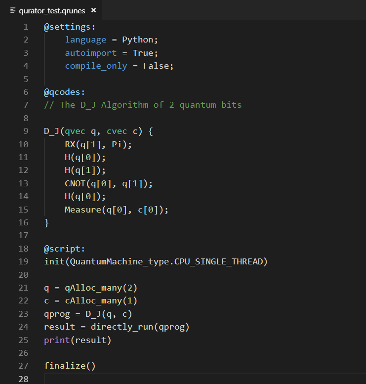
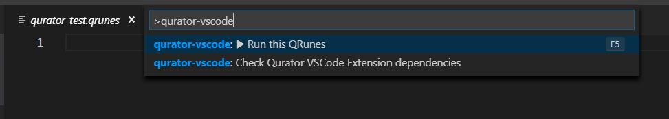

快速入门
=============

在做好准备工作之后，下面就可以编写属于您自己的量子程序了。

1.项目文件夹中启动 VS Code
-------------------------------

在命令提示符或终端上，创建一个名为 "test" 的空文件夹，切换到该文件夹，然后输入命令 code . 在该文件夹中打开 VS Code：

::

    mkdir test
    cd test
    code .

或者，您可以点击运行 VS Code，然后点击 "File" > "Open File..." 打开项目文件夹。

在文件夹中启动 VS Code，该文件夹将成为您的“工作区”。您可以在 .vscode/settings.json 文件中更改工作区的相关设置。

2.创建一个 qrunes 文件
------------------------

在文件资源管理器工具栏中，单击 "test" 文件夹上的 "New File" 按钮，并命名该文件为 qurator_test.qrunes。

.. image:: ../images/qurator_test.png
    :width: 600px

3.编写量子程序
----------------

qrunes 文件创建完成之后，便可以编写量子程序了。整个量子程序分为三个部分：settings、qcodes 和 script 三个模块。

其中，settings 模块中可以设置宿主语言，编译还是运行；qcodes 模块中可以编写 QRunes2 量子语言代码；
script 模块中可以编写宿主语言代码，目前支持 Python 和 C++ 两种宿主语言。

4.编译运行
-------------

点击右上方 Run this QRunes 运行程序，或者使用命令提示符 qurator-vscode: Run this QRunes 来运行程序(快捷键 F5)：

.. image:: ../images/runQRunes.png

上述示例程序的运行结果如下：

.. image:: ../images/result.png
    :width: 600px

